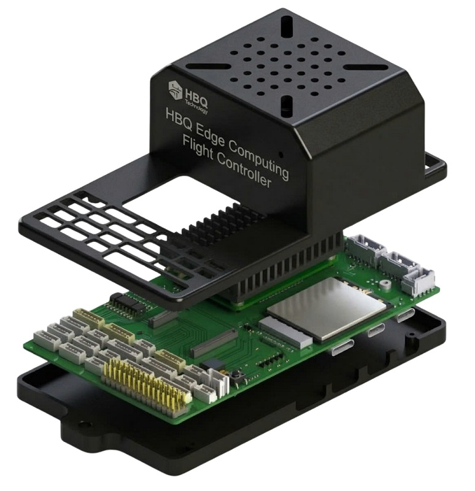
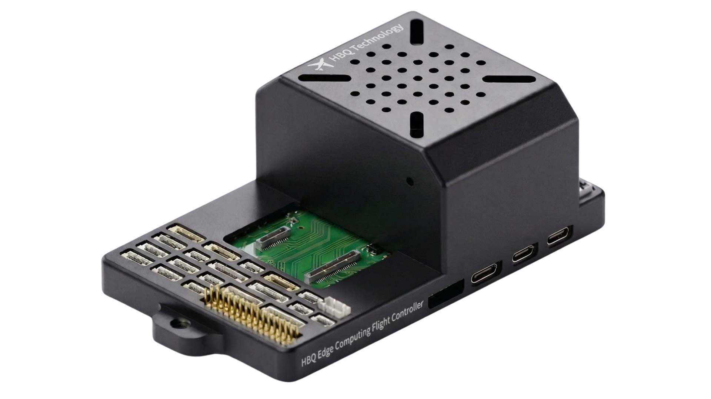

# Edge Computing Flight Controller — Pixhawk 6X

**Integration & software development guide** for the HBQ Edge Computing Flight Controller (Pixhawk 6X / FMUv6 + Raspberry Pi CM5 + optional 4G/5G).

This document focuses on **how to integrate the board into a vehicle**, **how to bring up the flight stack**, and **how to build applications on the CM5**. It is not a component-level datasheet.



---

## Table of contents

1. [What this platform is](#1-what-this-platform-is)
2. [Recommended integration workflow](#2-recommended-integration-workflow)
3. [Hardware integration (vehicle side)](#3-hardware-integration-vehicle-side)
4. [Flight software (FMU)](#4-flight-software-fmu)
5. [Edge compute software (CM5)](#5-edge-compute-software-cm5)
6. [Linking FMU ↔ CM5](#6-linking-fmu--cm5)
7. [Cellular & cloud connectivity](#7-cellular--cloud-connectivity)
8. [Application patterns](#8-application-patterns)
9. [Target use cases](#9-target-use-cases)
10. [Resources](#10-resources)

---

## 1. What this platform is

The board combines three domains on one baseboard:

| Domain | Role | What you develop here |
|--------|------|------------------------|
| **FMUv6 (Pixhawk 6X)** | Real-time flight control | PX4 / ArduPilot parameters, airframe, safety, sensors |
| **CM5 (Linux)** | Edge compute & autonomy | Vision, AI, ROS 2, mission logic, logging, UI |
| **4G/5G (M.2, optional)** | Backhaul | Telemetry, video uplink, OTA, fleet/cloud services |

**Design rule of thumb**

- Keep **hard real-time flight loops** on the FMU.
- Put **perception, planning, AI, and network services** on the CM5.
- Use **internal UART / Ethernet** between CM5 and FMU — do not invent a second companion-computer wiring stack.

```
Sensors / RC / Motors  →  FMU (PX4 / ArduPilot)
                              ↕ UART + Ethernet (onboard)
Cameras / AI / ROS 2   →  CM5 (Linux)
                              ↕ PCIe / USB (optional)
Cloud / GCS / Fleet    →  4G/5G modem + Ethernet
```


---

## 2. Recommended integration workflow

Follow this order when integrating a new vehicle or payload:

1. **Power & airframe** — Connect a valid power source, motors/servos, RC, and GPS. Confirm the FMU boots and arms safely with no CM5 software running yet.
2. **Flight stack bring-up** — Flash PX4 or ArduPilot, configure airframe, calibrate sensors, verify failsafe.
3. **Peripheral harness** — GPS, TELEM radios, CAN devices, cameras — one subsystem at a time.
4. **CM5 OS** — Install Ubuntu / Raspberry Pi OS, enable serial/Ethernet to FMU, verify MAVLink link.
5. **Application software** — MAVSDK / ROS 2 / OpenCV / TFLite on CM5.
6. **Connectivity** — Ethernet ground link first; then optional cellular modem and cloud endpoints.
7. **Field validation** — Bench → tethered → short flight → connected mission profile.

Do not skip step 1–2. Edge compute should never be required for basic flight safety.

---

## 3. Hardware integration (vehicle side)

### 3.1 What to connect first

| Interface | Typical use |
|-----------|-------------|
| Power inputs (priority-selected) | Vehicle power bricks / BEC |
| USB-C (FMU) | Flash firmware, QGroundControl / Mission Planner |
| GPS1 / GPS2 | Positioning (+ optional RTK) |
| TELEM1 / TELEM2 | Radio telemetry or companion links |
| CAN1 / CAN2 | DroneCAN ESCs, sensors, peripherals |
| PWM MAIN / AUX | Motors, servos, payloads |
| RC (PPM / SBUS / DSM) | Manual control & failsafe |
| CM5 HDMI / USB / CSI | Debug display, cameras, peripherals |
| CM5 Ethernet | High-bandwidth ground / LAN link |
| M.2 modem + SIM | Cellular backhaul (optional) |


### 3.2 Integration tips

- Treat the board as a **single vehicle computer**: one power plan, one grounding plan, one harness map.
- Prefer **internal CM5↔FMU links** for companion traffic; reserve external TELEM ports for radios / GCS.
- Bring up **GPS + RC + motors** before enabling AI or cellular services.
- For cameras, use CM5 CSI ports for onboard vision; keep FMU free for flight sensors.
- Cellular and high-current payloads need a clean power budget — validate brown-out / failover under load.

### 3.3 Safety before software

- Confirm safety switch / arming policy in the flight stack.
- Verify propeller-off bench tests before outdoor flights.
- Keep a manual RC path independent of CM5 and cellular apps.
- BVLOS / cellular operations must follow local regulations and link availability.

---

## 4. Flight software (FMU)

### 4.1 Supported stacks

| Stack | Notes |
|-------|--------|
| **PX4 Autopilot** (v1.14+) | FMUv6 / Pixhawk 6X class target |
| **ArduPilot** (4.4+) | Pixhawk6X-compatible target |
| **QGroundControl** | PX4 / dual-stack GCS |
| **Mission Planner** | ArduPilot GCS |

### 4.2 Bring-up checklist

1. Connect USB-C to a PC and confirm the board is detected.
2. Flash the appropriate PX4 or ArduPilot image for Pixhawk 6X / FMUv6.
3. Select airframe / vehicle type.
4. Calibrate accelerometer, compass, level horizon, radio, ESC as required by your stack.
5. Configure GPS, battery failsafe, RC loss, geofence.
6. Confirm logging and parameter backup before enabling companion features.

### 4.3 Keep flight logic on the FMU

Use the flight stack for:

- Attitude / position control
- Mixers, failsafes, RTL / land
- Sensor fusion and estimator health
- Arming, safety switch, motor output

Use the CM5 for high-level decisions that *command* the FMU (waypoints, velocity setpoints, camera-triggered actions) — not for replacing the inner loop.

---

## 5. Edge compute software (CM5)

### 5.1 OS choices

| OS | When to use |
|----|-------------|
| **Ubuntu 22.04 LTS** | ROS 2, research, custom AI stacks |
| **Raspberry Pi OS** | Lightweight bring-up, camera/tools, rapid prototyping |

### 5.2 Core toolchain (recommended)

- **Python 3** + `mavsdk` / `pymavlink`
- **ROS 2** (Humble / Iron) for robotics middleware
- **OpenCV** for vision pipelines
- **TensorFlow Lite** or **PyTorch** for onboard inference
- **GStreamer** for camera encode / stream
- **Docker** (optional) to package mission apps

### 5.3 CM5 bring-up checklist

1. Flash OS to eMMC / NVMe / boot media as designed for your CM5 module.
2. Boot, set hostname, enable SSH.
3. Confirm cameras (CSI) and Ethernet.
4. Confirm serial / Ethernet path to the FMU (see next section).
5. Install MAVSDK or ROS 2 MAVLink bridge and verify heartbeat from the FMU.
6. Only then deploy vision / AI / cloud services.

---

## 6. Linking FMU ↔ CM5

The platform is designed so the CM5 acts as an **onboard companion computer** without extra carrier boards.

### 6.1 Preferred data paths

| Path | Best for |
|------|----------|
| **UART (internal)** | Low-latency MAVLink commands, reliable control channel |
| **Ethernet (internal / external)** | High-bandwidth telemetry, logs, video-adjacent traffic, ROS ↔ flight bridge |
| **USB** | Development, flashing, temporary debug |

### 6.2 Typical software pattern

```
[Camera / AI / Planner on CM5]
        │  MAVSDK / pymavlink / ROS 2
        ▼
[MAVLink over UART or Ethernet]
        ▼
[PX4 / ArduPilot on FMU]
        ▼
[Motors / servos / navigation sensors]
```

Example goals once the link is up:

- Read pose / battery / mode from FMU
- Send offboard velocity or setpoint commands
- Trigger missions, camera capture, or payload actions
- Mirror selected telemetry to cloud / GCS

### 6.3 Development tips

- Start with **heartbeat + telemetry read-only**, then enable command uplink.
- Rate-limit offboard commands; never spam the FMU.
- Handle link loss on CM5: if companion dies, FMU failsafes must still work.
- Keep time sync and logging consistent across both domains for post-flight analysis.

---

## 7. Cellular & cloud connectivity

Optional M.2 4G/5G modem support is intended for **connected operations**, not as a replacement for local RC/radio failsafes.

### 7.1 Practical uses

- Fleet telemetry to a cloud dashboard
- Remote diagnostics and parameter review
- Live video / event clips uplink
- Mission upload / OTA of CM5 applications
- Low-rate command channel for supervised operations (where legally allowed)

### 7.2 Integration sequence

1. Validate Ethernet / Wi‑Fi / radio GCS path first.
2. Install a compatible modem + SIM + antennas.
3. Bring up cellular data on CM5 (NetworkManager / ModemManager / vendor tools).
4. Tunnel or publish MAVLink / app telemetry over VPN / MQTT / HTTPS as needed.
5. Test disconnect behavior: FMU must remain safe if cellular drops.

### 7.3 Security baseline

- Prefer VPN or authenticated MQTT/HTTPS endpoints.
- Do not expose raw MAVLink ports to the public internet.
- Separate credentials for development vs production fleets.
- Log and alert on unexpected uplink / command sources.

---

## 8. Application patterns

These are the most common software architectures teams implement on this board.

### 8.1 Companion autonomy (MAVSDK)

- CM5 runs a Python/C++ app using **MAVSDK**
- App consumes camera / GNSS / mission state
- App sends offboard setpoints or mission items to PX4/ArduPilot
- Good for: inspection triggers, follow-me logic, scripted industrial missions

### 8.2 ROS 2 robotics stack

- CM5 runs **ROS 2** nodes (perception, planning, payload drivers)
- Bridge ROS topics ↔ MAVLink
- Good for: research platforms, multi-sensor fusion, complex UGV/UAV payloads

### 8.3 Vision & Edge AI

- Capture from one or two CSI cameras
- Run OpenCV / TFLite / PyTorch inference on CM5
- Publish detections as MAVLink / ROS messages (object tracks, obstacle flags, landing cues)
- Stream annotated video via GStreamer over Ethernet or cellular

### 8.4 Connected fleet service

- Local app on CM5 aggregates flight + payload health
- Publishes to cloud (MQTT/HTTP)
- Operators monitor fleet status; critical flight safety remains on FMU + RC/radio

```
CSI Camera → Vision/AI (CM5) → Decision/App → MAVLink → FMU
                 ↓
            GStreamer / MQTT
                 ↓
         GCS / Cloud / Fleet UI
```

---

## 9. Target use cases

| Domain | Example applications |
|--------|----------------------|
| **UAV** | Mapping, inspection, delivery support, connected survey missions |
| **UGV** | Agricultural robots, patrol, logistics platforms |
| **Marine** | ASV/USV with autonomy + cloud telemetry |
| **Edge AI** | Detection, tracking, VIO assist, obstacle awareness |
| **Connected ops** | Remote monitoring, OTA app updates, supervised teleoperation workflows |

The platform fits best when **flight control + onboard perception + network services** must ship as one integrated product rather than three separate boxes.



---

## 10. Resources

| Resource | Location |
|----------|----------|
| Architecture / block diagram | [`images/Edge Computing Flight Controller FMU6x.jpg`](images/Edge%20Computing%20Flight%20Controller%20FMU6x.jpg) |
| Baseboard block diagram | [`images/FC_computer_baseBoard_Block_diagram.jpg`](images/FC_computer_baseBoard_Block_diagram.jpg) |
| Product photos / renders | [`images/`](images/) |
| Technical wiki (EN/VI) | [HBQ Product Wiki — Edge Computing Flight Controller](https://wiki.hbqsolution.com/) *(or your published `HBQ_EC_FC.html`)* |
| PX4 docs | https://docs.px4.io |
| ArduPilot docs | https://ardupilot.org |
| MAVSDK | https://mavsdk.mavlink.io |
| ROS 2 | https://docs.ros.org |

---

## Quick reference — do / don't

**Do**

- Bring up FMU flight safety first
- Use CM5 for perception, planning, networking
- Keep RC / radio failsafe independent of apps
- Version and backup parameters + CM5 images

**Don't**

- Move inner-loop control into Python/ROS without a real-time design
- Depend on cellular for basic vehicle safety
- Wire an external companion computer when the onboard CM5 path already exists
- Deploy cloud command channels without authentication and failsafe policy

---

*Focus of this README: integration, software bring-up, and application development. For pin-level schematics and manufacturing data, use the released hardware documentation package.*
